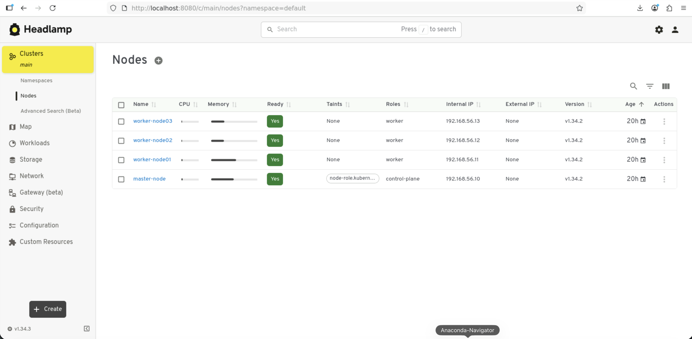

# LAB 0 - Découverte et Prise en main du Cluster Kubernetes

**Contexte :**
Pour optimiser le temps de formation et nous concentrer sur l'utilisation de Kubernetes, le cluster a déjà été pré-installé sur votre environnement.

### Objectifs du TP

1. Comprendre l'architecture qui a été déployée pour vous.
2. Connecter votre outil de commande local (`kubectl`) au cluster.
3. Accéder au **Dashboard Kubernetes** (Interface Web).

---

## Partie 1 : Comprendre l'infrastructure en place

Avant de toucher au clavier, il est important de comprendre ce qui tourne actuellement sur votre machine.

Nous avons automatisé le déploiement d'une architecture **"Multi-Node"** standard. Au lieu d'installer les composants un par un manuellement, nous avons utilisé :

* **Vagrant & VirtualBox :** Pour créer les machines virtuelles.
* **Kubeadm :** L'outil officiel de la communauté Kubernetes pour "bootstraper" (démarrer) un cluster de manière sécurisée et standardisée.

**Ce qui tourne actuellement :**

* **1 Nœud Master (Control Plane) :** C'est le chef d'orchestre. Il contient la base de données (etcd), l'API Server et les planificateurs.
* **3 Nœuds Workers (node01, node02, node03) :** C'est là que vos applications (conteneurs) vont réellement tourner.
* **Le Dashboard :** L'interface web officielle a déjà été pré-déployée dans le cluster.

> **Pour les curieux (Documentation officielle) :**
> Si vous souhaitez voir comment on installe un cluster "from scratch" avec Kubeadm, c'est par ici : [Documentation Kubeadm](https://kubernetes.io/docs/setup/production-environment/tools/kubeadm/create-cluster-kubeadm/).

> Quant au Dashboard, le projet officiel [Kubernetes dashboard](https://github.com/kubernetes-retired/dashboard) a été archivé le mois dernier en faveur du projet [Headlamp](https://github.com/kubernetes-sigs/headlamp). c'est ce que nous avons installé

**Vérification de l'état des machines :**
Ouvrez un terminal **PowerShell** dans le dossier du projet pour vérifier que les VMs sont bien allumées.

```bash
cd ~/k8s-install
vagrant status

```

> **Résultat attendu :** Vous devriez voir `master`, `node01`, `node02`, `node03` avec le statut **running**.

---

## Partie 2 : Connexion au Cluster (Configuration du Client)

Pour discuter avec le cluster depuis votre Windows (sans entrer en SSH dans les VMs), nous avons besoin de l'outil `kubectl`.

**1. Installation de l'outil (si nécessaire)** _(déjà fait sur vos Machines)_

Documentation : [Installation de Kubectl sur Linux](https://kubernetes.io/docs/tasks/tools/install-kubectl-linux/)

**2. Récupération de fichier kubeconfig ("Carte d'identité" du cluster)** _(déjà fait sur vos Machines)_

Pour que `kubectl` sache où se connecter et avec quels droits, il a besoin d'un fichier de configuration (appelé `kubeconfig`). Ce fichier a été généré lors de l'installation automatique. Nous l'avez placé à l'emplacement attendu `~/.kube/config`

**3. Test de la connexion**
Interrogez le cluster pour lister les nœuds. Si la commande répond, la connexion est établie !

```bash
kubectl get nodes
```

Un alias `k` pour kubectl est configuré

```bash
k get nodes -o wide
```

> **Résultat attendu :**
> ```text
>NAME            STATUS   ROLES           AGE   VERSION   INTERNAL-IP     EXTERNAL-IP   OS-IMAGE             KERNEL-VERSION     CONTAINER-RUNTIME
>master-node     Ready    control-plane   20m   v1.35.4   192.168.56.10   <none>        Ubuntu 24.04.3 LTS   6.8.0-86-generic   containerd://2.2.0
>worker-node01   Ready    worker          17m   v1.35.4   192.168.56.11   <none>        Ubuntu 24.04.3 LTS   6.8.0-86-generic   containerd://2.2.0
>worker-node02   Ready    worker          14m   v1.35.4   192.168.56.12   <none>        Ubuntu 24.04.3 LTS   6.8.0-86-generic   containerd://2.2.0
>worker-node03   Ready    worker          12m   v1.35.4   192.168.56.13   <none>        Ubuntu 24.04.3 LTS   6.8.0-86-generic   containerd://2.2.0
> 
> 
> Si vous voyez `Ready`, félicitations : vous êtes administrateur du cluster.

---

## Partie 3 : Accès au Dashboard (Interface Graphique)

Documentation : 
* [Installation du Dashboard Kubernetes](https://kubernetes.io/docs/tasks/access-application-cluster/web-ui-dashboard/) (Projet archivé le mois de Janvier 2026) en faveur de [Headlamp](https://github.com/kubernetes-sigs/headlamp)

Le Dashboard est déjà installé.

### Etape 1 : Generation de token et création de tunnel

Pour accéder au Dashboard Kubernetes Headlamp, exécutez le script `access-dashboard.sh`; le script génère un token d'authentification qui n'est pas permanent et ouvre un tunnel de connexion au conteneur de dashboard qui tourne sur le cluster Kubernetes.

Ne fermez pas ce terminal

> ⚠️ **Important :** Une longue chaîne de caractères va s'afficher. **Copiez-la** (Sélectionnez + Clic Droit ou Ctrl+C), nous en aurons besoin dans 1 minute.

### Etape 2 : Connexion via navigateur Web

1. Ouvrez votre navigateur web.
2. Allez sur : [http://localhost:8080](http://localhost:8080)
* Collez le jeton récupéré à l'étape B.
* Validez.

### Etape 3 : Exploration

Vous voilà sur l'interface ! naviguez et explorez l'environement Kubernetes.

